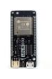
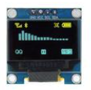
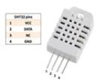
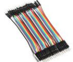
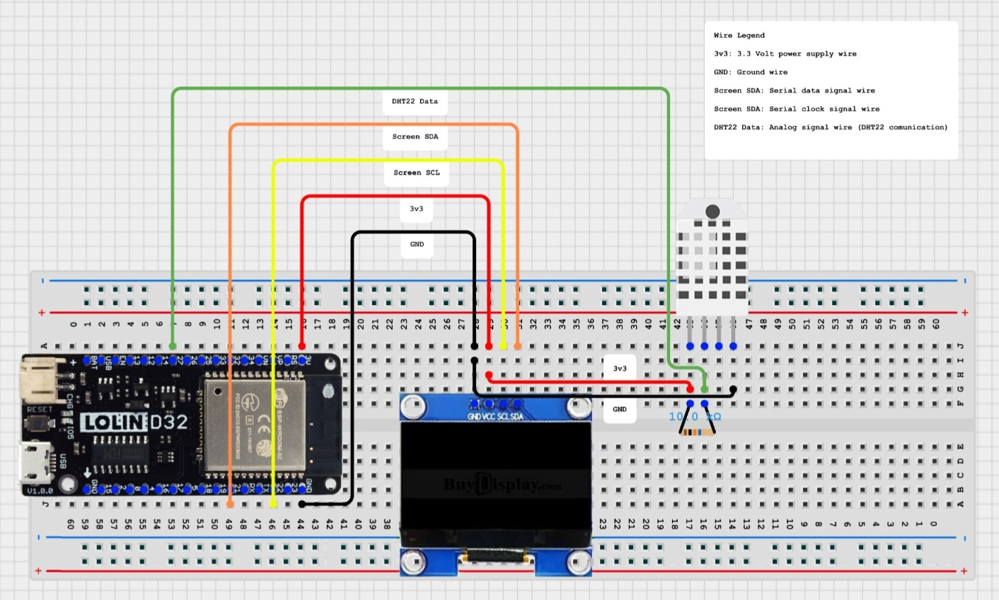
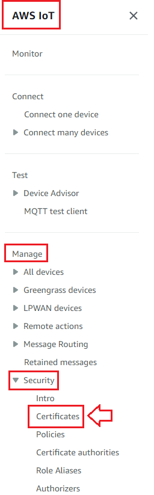
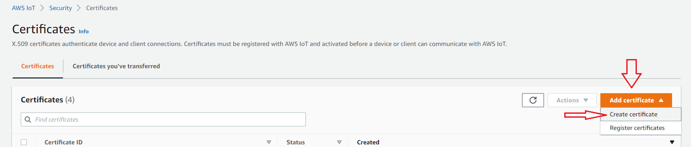
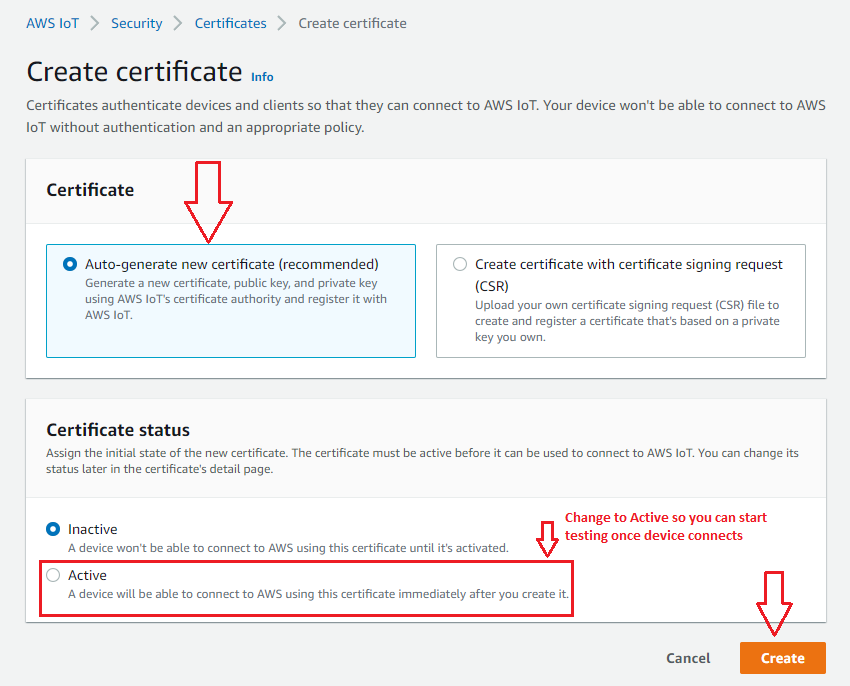
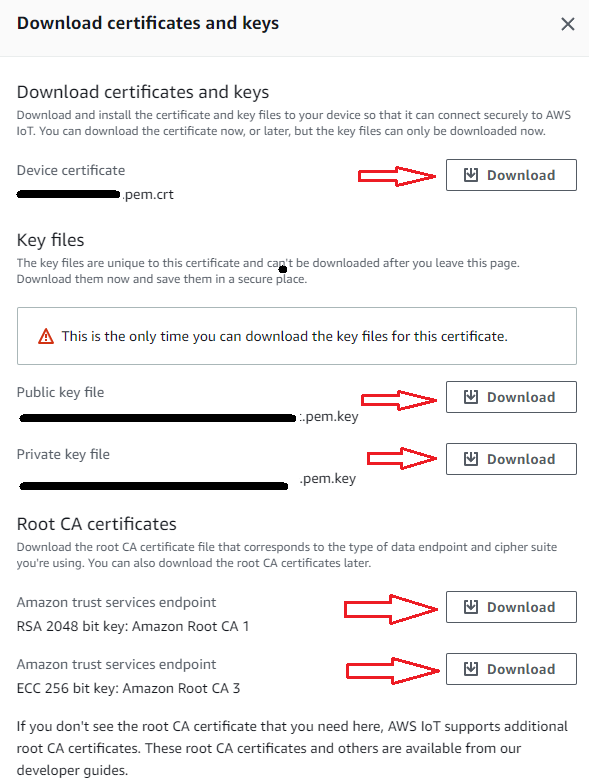
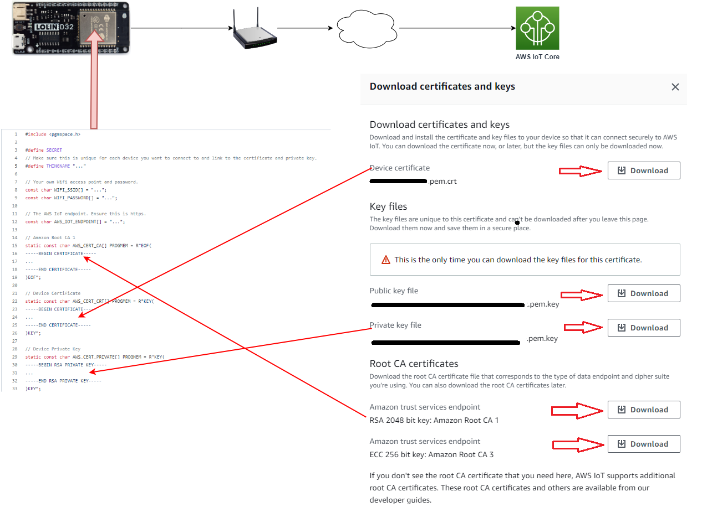

<!-- Add banner here -->

# Weatherstation

<!-- Add buttons here -->

Basic code for using ESP32 with AWS IoT and DHT22 sensor to send MQTT data every 10 minutes

<!-- The project title should be self explanotory and try not to make it a mouthful. (Although exceptions exist- **awesome-readme-writing-guide-for-open-source-projects** - would have been a cool name)

Add a cover/banner image for your README. **Why?** Because it easily **grabs people's attention** and it **looks cool**(*duh!obviously!*).

The best dimensions for the banner is **1280x650px**. You could also use this for social preview of your repo.

I personally use [**Canva**](https://www.canva.com/) for creating the banner images. All the basic stuff is **free**(*you won't need the pro version in most cases*).

There are endless badges that you could use in your projects. And they do depend on the project. Some of the ones that I commonly use in every projects are given below. 

I use [**Shields IO**](https://shields.io/) for making badges. It is a simple and easy to use tool that you can use for almost all your badge cravings. -->

<!-- Some badges that you could use -->

<!-- 
: This badge shows the version of the current release.


: I think it is self-explanatory. This gives people an idea about how the project is being maintained.


: This is a dynamic badge from [**Shields IO**](https://shields.io/) that tracks issues in your project and gets updated automatically. It gives the user an idea about the issues and they can just click the badge to view the issues.


: This is also a dynamic badge that tracks pull requests. This notifies the maintainers of the project when a new pull request comes.

: If you are not like me and your project gets a lot of downloads(*I envy you*) then you should have a badge that shows the number of downloads! This lets others know how **Awesome** your project is and is worth contributing to.


: This shows what kind of open-source license your project uses. This is good idea as it lets people know how they can use your project for themselves.

: This is not essential but it is a cool way to let others know about your project! Clicking this button automatically opens twitter and writes a tweet about your project and link to it. All the user has to do is to click tweet. Isn't that neat? -->

# Demo-Preview

<!-- Add a demo for your project -->

<!-- After you have written about your project, it is a good idea to have a demo/preview(**video/gif/screenshots** are good options) of your project so that people can know what to expect in your project. You could also add the demo in the previous section with the product description.

Here is a random GIF as a placeholder.

 -->

# Table of Contents

<!-- After you have introduced your project, it is a good idea to add a **Table of contents** or **TOC** as **cool** people say it. This would make it easier for people to navigate through your README and find exactly what they are looking for.

Here is a sample TOC(*wow! such cool!*) that is actually the TOC for this README. -->

- [Project Title](#project-title)
- [Demo-Preview](#demo-preview)
- [Table of Contents](#table-of-contents)
- [Bill of Materials](#bill-of-material)
- [Installation](#installation)
- [Build](#build)
- [Development](#development)
- [License](#license)
- [Footer](#footer)
<!-- removed this - not sure 
    - [Contribute](#contribute)
    - [Sponsor](#sponsor)
    - [Adding new features or fixing bugs](#adding-new-features-or-fixing-bugs)-->

# Bill of Material

[Wemos D32 V1.0.0 - ESP32](https://opencircuit.nl/product/Wemos-D32-V1.0.0-ESP32-CH340C-4MB-Flash)


[0.96 OLED Display module](https://opencircuit.nl/product/0.96-OLED-Display-module-geel-blauw-I2C)


[DHT22 sensor](https://opencircuit.nl/product/dht22-luchtvochtigheid-en-temperatuur-sensor)


[10KΩ Metalfilm Resistor](https://opencircuit.nl/product/10K%CE%A9-Metaalfilm-weerstand-1-4W-10-stuks)


[Male-Male 10cm cables](https://opencircuit.nl/product/male-male-10-cm-bandkabel-40-stuks)


[Breadboard 830 point](https://opencircuit.nl/product/breadboard-830-punten-wit)

[(Back to top)](#table-of-contents)

# Build
Follow the steps to create the build for the Weatherstation on the Breadboard.
Place the Wemos D32 V1.0.0 - ESP32 onto the breadboard. Space the ESP placement on the left in between the power connector lines with the power usb connector on the left side.
Insert the 0.96 OLED Display module into the breadboard next to the ESP32 on the right side.
Next insert the DHT22 sensor into the breadboard on the right of the display.
Follow the color coded instructions connecting the components up with male-male cables.



[(Back to top)](#table-of-contents)

<!-- This is optional and it is used to give the user info on how to use the project after installation. This could be added in the Installation section also. -->

# Installation
After connecting the compenents on the breadboard correctly following the color coded diagram, connect the ESP32 to your computer with a micro usb cable. Open VSCode and save a new workspace. Clone the Github project into a folder on your comoputer. Add the folder to the new workspace and save the workspace again. Now you ready to start working with your codebase.

On the left side of VSCode select Extensions and search for PlatformIO IDE - Install the extension.
The main source code is located inside the src folder inside the esp32-dht22-ldr folder.
The two main files used is main.cpp and secrets.h.

Main.cpp contains all the sensor code functions.
Secrets.h contain user variables for AWS certificates and Wifi details.

[(Back to top)](#table-of-contents)

<!-- *You might have noticed the **Back to top** button(if not, please notice, it's right there!). This is a good idea because it makes your README **easy to navigate.*** 

The first one should be how to install(how to generally use your project or set-up for editing in their machine).

This should give the users a concrete idea with instructions on how they can use your project repo with all the steps.

Following this steps, **they should be able to run this in their device.**

A method I use is after completing the README, I go through the instructions from scratch and check if it is working. -->

<!-- Here is a sample instruction:

To use this project, first clone the repo on your device using the command below:

```git init```

```git clone https://github.com/navendu-pottekkat/nsfw-filter.git``` -->

# Development
For the section below, you will need an AWS Console login. Once you logged in, follow the steps below to create your device certificate that will be used to verify and authentic your 
device. Each device in the field needs it very own unique certificate 











[(Back to top)](#table-of-contents)

<!-- This is the place where you give instructions to developers on how to modify the code.

You could give **instructions in depth** of **how the code works** and how everything is put together.

You could also give specific instructions to how they can setup their development environment.

Ideally, you should keep the README simple. If you need to add more complex explanations, use a wiki. Check out [this wiki](https://github.com/navendu-pottekkat/nsfw-filter/wiki) for inspiration. -->

<!--# Contribute
[(Back to top)](#table-of-contents)-->

<!-- This is where you can let people know how they can **contribute** to your project. Some of the ways are given below.

Also this shows how you can add subsections within a section. -->

<!--### Sponsor
[(Back to top)](#table-of-contents)-->

<!-- Your project is gaining traction and it is being used by thousands of people(***with this README there will be even more***). Now it would be a good time to look for people or organisations to sponsor your project. This could be because you are not generating any revenue from your project and you require money for keeping the project alive.

You could add how people can sponsor your project in this section. Add your patreon or GitHub sponsor link here for easy access.

A good idea is to also display the sponsors with their organisation logos or badges to show them your love!(*Someday I will get a sponsor and I can show my love*) -->

<!--### Adding new features or fixing bugs
[(Back to top)](#table-of-contents)-->

<!-- This is to give people an idea how they can raise issues or feature requests in your projects. 

You could also give guidelines for submitting and issue or a pull request to your project.

Personally and by standard, you should use a [issue template](https://github.com/navendu-pottekkat/nsfw-filter/blob/master/ISSUE_TEMPLATE.md) and a [pull request template](https://github.com/navendu-pottekkat/nsfw-filter/blob/master/PULL_REQ_TEMPLATE.md)(click for examples) so that when a user opens a new issue they could easily format it as per your project guidelines.

You could also add contact details for people to get in touch with you regarding your project. -->

# License
[(Back to top)](#table-of-contents)

<!-- Adding the license to README is a good practice so that people can easily refer to it.

Make sure you have added a LICENSE file in your project folder. **Shortcut:** Click add new file in your root of your repo in GitHub > Set file name to LICENSE > GitHub shows LICENSE templates > Choose the one that best suits your project!

I personally add the name of the license and provide a link to it like below. -->

[GNU General Public License version 3](https://opensource.org/licenses/GPL-3.0)

# Footer
[(Back to top)](#table-of-contents)

<!-- Let's also add a footer because I love footers and also you **can** use this to convey important info.

Let's make it an image because by now you have realised that multimedia in images == cool(*please notice the subtle programming joke). -->

Leave a star in GitHub, give a clap in Medium and share this guide if you found this helpful.

<!-- Add the footer here -->

<!--  -->
